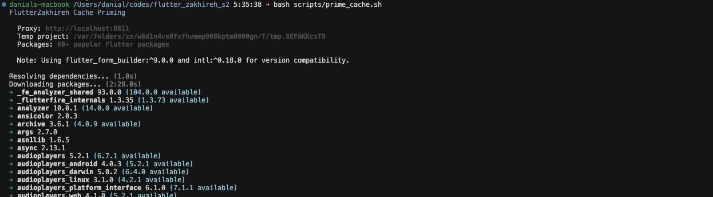
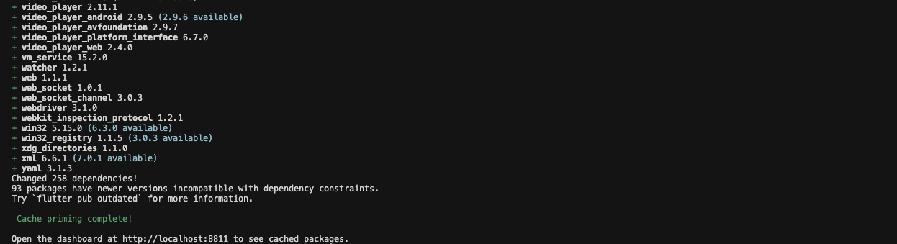
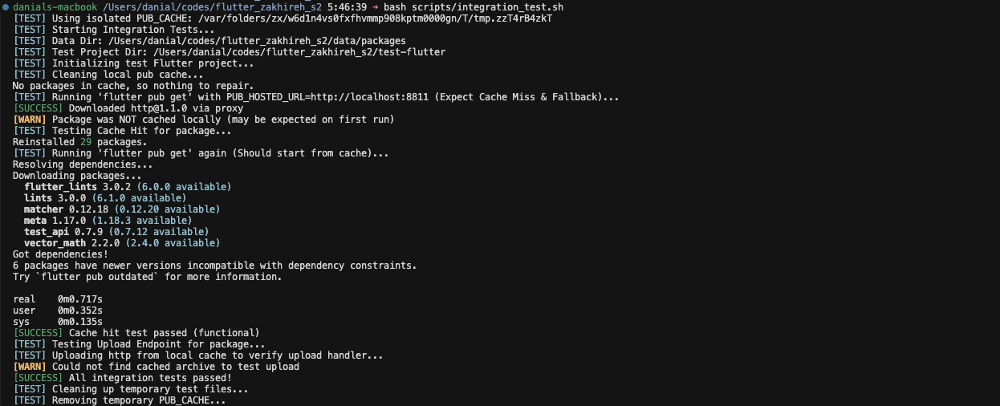

# How to Use FlutterZakhireh

FlutterZakhireh is a lightweight, local Flutter/Dart package proxy that caches
packages from `pub.dev` for offline use, faster builds, and air-gapped
environments. It's designed for extreme simplicity and hackability, providing a
transparent and easy-to-customize alternative to larger proxy solutions. This
guide walks you through setting it up and using it in your development workflow.

---

## [.] Table of Contents

- [Quick Start](#quick-start)
- [Installation](#installation)
- [Configuration](#configuration)
- [Using FlutterZakhireh](#using-flutterzakhireh)
- [Advanced Usage](#advanced-usage)
- [Troubleshooting](#troubleshooting)

---

```text
   ____        _      __      _____ __             __ 
  / __ \__  __(_)____/ /__   / ___// /_____ ______/ /_
 / / / / / / / / ___/ //_/   \__ \/ __/ __ `/ ___/ __/
/ /_/ / /_/ / / /__/ ,<     ___/ / /_/ /_/ / /  / /_  
\___\_\__,_/_/\___/_/|_|   /____/\__/\__,_/_/   \__/  
```

### 1. Start the Server

```bash
# Option A: Run directly with Go
go run ./cmd/server

# Option B: Build and run the binary
go build -o flutterzakhireh ./cmd/server
./flutterzakhireh

# Option C: Use Docker
docker-compose up -d
```

The server starts on `http://localhost:8811` by default.

### 2. Configure Your Flutter Environment

Point the Dart/Flutter tooling at your local FlutterZakhireh instance by setting
`PUB_HOSTED_URL`:

```bash
# Temporary (current shell session only)
export PUB_HOSTED_URL=http://localhost:8811
```

To make it permanent, add this line to your shell profile (`~/.bashrc`,
`~/.zshrc`, etc.):

```bash
echo 'export PUB_HOSTED_URL=http://localhost:8811' >> ~/.zshrc
source ~/.zshrc
```

> **Note:** `PUB_HOSTED_URL` is the supported way to redirect `pub`. You can
> *also* route traffic through the proxy via an HTTPS proxy (`https_proxy`),
> but `PUB_HOSTED_URL` is the canonical, recommended method.

### 3. Download Packages

Now when you run `flutter pub get` (or `dart pub get`), packages will be cached
through FlutterZakhireh:

```bash
cd your-project
flutter pub get
```

### 4. View the Dashboard

Open your browser and navigate to `http://localhost:8811`. You'll see all
cached packages, their versions, and sizes.

---

```text
    ____           __        ____      __  _           
   /  _/___  _____/ /_____ _/ / /___ _/ /_(_)___  ____ 
   / // __ \/ ___/ __/ __ `/ / / __ `/ __/ / __ \/ __ \
 _/ // / / (__  ) /_/ /_/ / / / /_/ / /_/ / /_/ / / / /
/___/_/ /_/____/\__/\__,_/_/_/\__,_/\__/_/\____/_/ /_/ 
```

### Prerequisites

- **Go 1.22+** (for building from source)
- **Flutter/Dart SDK** (for consuming the proxy)
- **Docker** (optional, for containerized deployment)

### From Source

```bash
# Clone the repository
git clone https://github.com/GolangZakhireh/flutter_zakhireh.git
cd flutter_zakhireh

# Build the binary
go build -o flutterzakhireh ./cmd/server

# Run it
./flutterzakhireh
```

### Using Docker

```bash
# Build and start with docker-compose
docker-compose up -d

# Or build manually
docker build -t flutterzakhireh:latest .
docker run -p 8811:8811 -v ./data/packages:/data/packages flutterzakhireh:latest
```

---

```text
   ______            _____                        __  _           
  / ____/___  ____  / __(_)___ ___  ___________ _/ /_(_)___  ____ 
 / /   / __ \/ __ \/ /_/ / __ `/ / / / ___/ __ `/ __/ / __ \/ __ \
/ /___/ /_/ / / / / __/ / /_/ / /_/ / /  / /_/ / /_/ / /_/ / / / /
\____/\____/_/ /_/_/ /_/\__, /\__,_/_/   \__,_/\__/_/\____/_/ /_/ 
                       /____/                                     
```

FlutterZakhireh is configured via environment variables:

| Variable | Default | Description |
|:---|:---|:---|
| `FLUTTERZAKHIREH_PORT` | `:8811` | Port to listen on |
| `FLUTTERZAKHIREH_DATA_DIR` | `./data/packages` | Directory to store cached packages |
| `FLUTTERZAKHIREH_UPSTREAM` | `https://pub.dev` | Upstream package server URL |
| `FLUTTER_NO_SUMDB` | (empty) | Comma-separated glob patterns for private packages |
| `FLUTTERZAKHIREH_ALLOW` | (empty) | Comma-separated list of allowed package patterns |
| `FLUTTERZAKHIREH_DENY` | (empty) | Comma-separated list of denied package patterns |

### Example: Custom Configuration

```bash
export FLUTTERZAKHIREH_PORT=:9000
export FLUTTERZAKHIREH_DATA_DIR=/var/cache/flutter-packages
export FLUTTERZAKHIREH_UPSTREAM=https://pub.dev
export FLUTTER_NO_SUMDB=my_private_pkg,*.corp.example.com
```

---

```text
   __  __                         ______      _     __   
  / / / /________ _____ ____     / ____/_  __(_)___/ /__ 
 / / / / ___/ __ `/ __ `/ _ \   / / __/ / / / / __  / _ \
/ /_/ (__  ) /_/ / /_/ /  __/  / /_/ / /_/ / / /_/ /  __/
\____/____/\__,_/\__, /\___/   \____/\__,_/_/\__,_/\___/ 
                /____/                                   
```

### Basic Workflow

1.  **Start FlutterZakhireh server** (see Quick Start)
2.  **Configure your Flutter environment** (`export PUB_HOSTED_URL=...`)
3.  **Use Flutter commands normally** - packages are cached automatically on
    first download and served from cache thereafter

### Commands That Use the Proxy

All standard pub commands use FlutterZakhireh once `PUB_HOSTED_URL` is set:

```bash
flutter pub get
dart pub get
flutter pub upgrade
flutter pub add http
```

### Verifying It's Working

Check the dashboard at `http://localhost:8811` to see cached packages, or check
the data directory:

```bash
ls -la ./data/packages/
```

Each package is stored as `<package>/<version>.tar.gz`, with metadata cached as
`<package>/package.meta.json` and `<package>/<version>.meta.json`.

---

```text
    ___       __                                __   __  __        
   /   | ____/ /   ______ _____  ________  ____/ /  / / / /_______ 
  / /| |/ __  / | / / __ `/ __ \/ ___/ _ \/ __  /  / / / / ___/ _ \
 / ___ / /_/ /| |/ / /_/ / / / / /__/  __/ /_/ /  / /_/ (__  )  __/
/_/  |_\__,_/ |___/\__,_/_/ /_/\___/\___/\__,_/   \____/____/\___/ 
```

### Priming the Cache

Use the included script to pre-download popular packages. This is useful for
initializing a fresh installation or building an offline mirror:

```bash
./scripts/prime_cache.sh
```




*The priming script ensures common libraries are available immediately.*

### Private Modules

For private packages that shouldn't be verified against the public sum database:

```bash
export FLUTTER_NO_SUMDB=my_private_pkg,*.corp.example.com
```

### Access Control

**Allow only specific packages:**
```bash
export FLUTTERZAKHIREH_ALLOW=http,dio,provider,flutter_*
```

**Deny specific packages:**
```bash
export FLUTTERZAKHIREH_DENY=forbidden_pkg
```

### Manual Upload

Upload private packages manually via the `/upload` endpoint:

```bash
curl -X POST http://localhost:8811/upload \
  -F "package=my_private_pkg" \
  -F "version=1.0.0" \
  -F "archive=@my_private_pkg-1.0.0.tar.gz" \
  -F "metadata=@package.meta.json"
```

---

```text
  ______                 __    __          __                __ 
 /_  __/________  __  __/ /_  / /__  _____/ /_  ____  ____  / /_
  / / / ___/ __ \/ / / / __ \/ / _ \/ ___/ __ \/ __ \/ __ \/ __/
 / / / /  / /_/ / /_/ / /_/ / /  __(__  ) / / / /_/ / /_/ / /_  
/_/ /_/   \____/\__,_/_.___/_/\___/____/_/ /_/\____/\____/\__/
```

### Server Not Starting

**Check if port is already in use:**
```bash
lsof -i :8811
```

**Use a different port:**
```bash
export FLUTTERZAKHIREH_PORT=:9000
./flutterzakhireh
```

### Integration Test

If you suspect something is wrong with the proxy logic, run the integration test:

```bash
./scripts/integration_test.sh
```



*The integration test verifies the full download and cache cycle.*

### Package Not Found / Cache Not Filling

- Confirm `PUB_HOSTED_URL` is set correctly (`http://localhost:8811`, no trailing
  slash, no `/packages` suffix).
- Check the FlutterZakhireh server logs for upstream errors.
- Ensure the upstream (`FLUTTERZAKHIREH_UPSTREAM`) is reachable from the server.

### Clear Cache

To clear all cached packages and start fresh:

```bash
./scripts/cleanup.sh
```

---

**[Back to README.md](README.md)**

<!-- 
ASCII ART GENERATION
====================
Regenerate these banners using the following commands:

- Project Banner: figlet -w 450 -f ~/codes/ANSI_Shadow.flf "Flutter Zakhireh"
- Section Headers: figlet -f slant "Text Here"

Preserved for maintenance/regeneration of the documentation aesthetics.
-->
