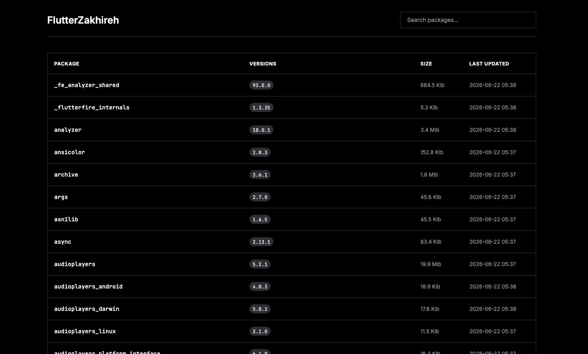
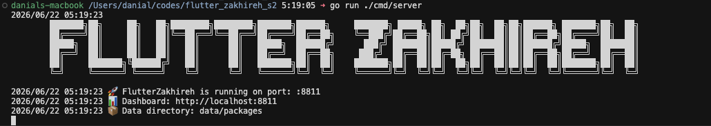

```text
    ________      __  __               _____         __   __    _           __  
   / ____/ /_  __/ /_/ /____  _____   /__  /  ____ _/ /__/ /_  (_)_______  / /_ 
  / /_  / / / / / __/ __/ _ \/ ___/     / /  / __ `/ //_/ __ \/ / ___/ _ \/ __ \
 / __/ / / /_/ / /_/ /_/  __/ /        / /__/ /_/ / ,< / / / / / /  /  __/ / / /
/_/   /_/\__,_/\__/\__/\___/_/        /____/\__,_/_/|_/_/ /_/_/_/   \___/_/ /_/ 
```

FlutterZakhireh is a robust, local Flutter package proxy designed for teams working in air-gapped or restricted environments. It caches packages locally and serves them to developers, ensuring reliable builds even when the upstream internet is unstable or inaccessible.

---

## [.] Features

*   **Offline Mode**: Serves cached packages without internet access.
*   **Package Upload**: Supports manual upload of private packages (`.tar.gz`, `.json`).
*   **Dashboard**: Minimal Web UI to view cached packages, sizes, and versions.
*   **Private Packages**: Support for `FLUTTER_NO_SUMDB` and allow/deny lists.

**[Read the complete How-To Guide](HOWTO.md)** for detailed setup and usage instructions.

---

## [.] Dashboard



*The minimalist dashboard provides a clear overview of your cached packages.*

---

## [.] Getting Started

### Running Locally

1.  **Start the server:**
    ```bash
    go run ./cmd/server
    ```
    The server listens on `:8811` by default.

    

2.  **Configure your Flutter environment:**
    Point `pub` at the proxy with the `PUB_HOSTED_URL` environment variable:
    ```bash
    export PUB_HOSTED_URL=http://localhost:8811
    ```

3.  **Download packages:**
    Simply run `flutter pub get` in your projects. FlutterZakhireh fetches
    packages from `pub.dev` on first request, **rewrites their archive URLs to
    point back at the proxy**, caches them to disk, and serves them from the
    cache on every subsequent request.

4.  **View Dashboard:**
    Open [http://localhost:8811](http://localhost:8811) in your browser.

### Running with Docker

```bash
docker-compose up -d
```
This will start FlutterZakhireh and mount `./data/packages` for persistence.

---

## [.] Configuration

Configuration is managed via environment variables:

| Variable | Default | Description |
|:---|:---|:---|
| `FLUTTERZAKHIREH_PORT` | `:8811` | Port to listen on. |
| `FLUTTERZAKHIREH_DATA_DIR` | `./data/packages` | Directory to store cached packages. |
| `FLUTTERZAKHIREH_UPSTREAM` | `https://pub.dev` | Upstream proxy URL. |
| `FLUTTER_NO_SUMDB` | (empty) | Comma-separated glob patterns for private packages. |
| `FLUTTERZAKHIREH_ALLOW` | (empty) | Comma-separated list of allowed package patterns. |
| `FLUTTERZAKHIREH_DENY` | (empty) | Comma-separated list of denied package patterns. |

---

## [.] Testing & Maintenance

### Testing
Run unit tests:
```bash
go test ./...
```

Run integration tests (requires server running):
```bash
./scripts/integration_test.sh
```

### Cleanup
To remove all cached data and logs:
```bash
./scripts/cleanup.sh
```

### Prime Cache
To pre-populate cache with popular Flutter packages:
```bash
./scripts/prime_cache.sh
```

---

## [.] Usage with Flutter Apps

```bash
export PUB_HOSTED_URL=http://localhost:8811
flutter clean
flutter pub get
```

The first `flutter pub get` populates the cache; subsequent runs (including by
other developers, or with the network disconnected) are served from cache.

> **Important:** Use `PUB_HOSTED_URL` to point `pub` at the proxy.
> Do **not** use `https_proxy` — FlutterZakhireh is a reverse proxy (origin
> server), not a forward CONNECT proxy. `https_proxy` would try to tunnel
> HTTPS traffic through the server, which is not supported.

---

## [.] License

MIT

<!-- 
ASCII ART GENERATION
====================
Regenerate these banners using the following commands:

- Project Banner: figlet -w 450 -f ~/codes/ANSI_Shadow.flf "Flutter Zakhireh"
- Section Headers: figlet -f slant "Text Here"

Preserved for maintenance/regeneration of the documentation aesthetics.
-->
